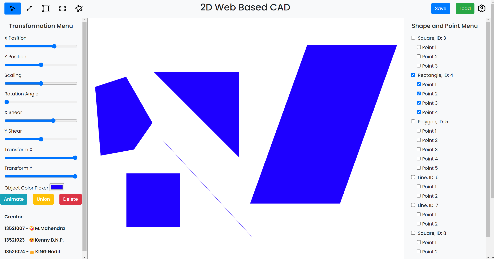
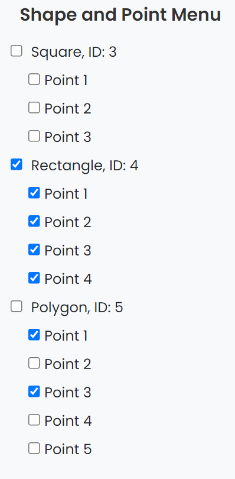
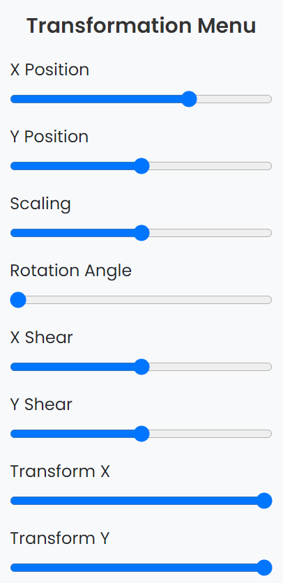

# 2D Web-Based CAD (Computer Aided Design)

> Tugas Besar 1 IF3260 Grafika Komputer

## Daftar Isi
- [Cara Menjalankan Program](#cara-menjalankan-program)
    - [Membuat Objek Baru](#membuat-objek-baru)
    - [Shape and Point Menu](#shape-and-point-menu)
    - [Transformasi Objek](#transformasi-objek)
    - [Menghapus elemen](#menghapus-elemen)
    - [Mengganti Warna Elemen](#mengganti-warna-elemen)
    - [Menganimasi Objek](#menganimasi-objek)
    - [Menggabung Objek](#menggabung-objek)
    - [Menyimpan dan Membuka File](#menyimpan-dan-membuka-file)
    - [Help](#help)
- [Kontributor](#kontributor)

## Cara Menjalankan Program

Buka file `index.html` pada browser

### Membuat Objek Baru
1. Pilih salah satu icon objek yang ingin dibuat (**Garis**, **Persegi**, **Persegi Panjang**, **Polygon**) pada ***toolbar***

2. Untuk **Polygon**
    - Klik pada canvas untuk menambahkan titik
    - Sebuah Polygon akan **terbentuk** ketika sudah terdapat minimal **3 titik**
3. Selain Polygon (**Garis**, **Persegi**, **Persegi Panjang**)
    - *Drag* pada canvas untuk membuat objek
    - Objek akan **terbentuk** ketika *drag* dilepas

### Shape and Point Menu
Setiap melakukan *action*, gunakan menu ini untuk memilh elemen untuk melakukan aksi

### Transformasi Objek

1. Pilih elemen objek yang ingin ditransformasi (**Objek** atau **Titik**) pada ***Shape and Point Menu***
2. Gunakan ***Slider*** untuk melakukan transformasi
3. Transformasi yang dapat dilakukan:
    - ***Translation*** (X, Y)
        - Menggeser koordinat **Objek** atau **Titik**
    - ***Rotation*** (Derajat)
        - Memutar **Objek** terhadap titik pusat
    - ***Scaling***
        - Memperbesar atau memperkecil **Objek** terhadap titik pusat
    - ***Shearing*** (X, Y)
        - Membengkokkan **Objek** terhadap sumbu X dan/atau Y
    - ***Transform*** (X, Y)
        - Mengubah panjang dan/atau lebar **Objek**

### Menghapus elemen
1. Pilih elemen yang ingin dihapus (**Objek** atau **Titik**) pada ***Shape and Point Menu***
2. Klik tombol **Delete**

### Mengganti Warna Elemen

1. Pilih elemen yang ingin diubah warnanya (**Objek** atau **Titik**) pada ***Shape and Point Menu***
2. Pilih warna yang diinginkan pada ***Color Picker***

### Menganimasi Objek
1. Pilih elemen **objek** yang ingin dianimasikan pada ***Shape and Point Menu***
2. Klik tombol **Animate** untuk memulai animasi

### Menggabung Objek
1. Pilih elemen **objek** yang ingin digabungkan pada ***Shape and Point Menu***
2. Klik tombol **Union** untuk menggabungkan objek-objek yang dipilih

### Menyimpan dan Membuka File

1. Klik tombol **Save** untuk **menyimpan** objek ke dalam file `.json`
2. Klik tombol **Load** untuk **memuat** objek pada file `.json` yang telah disimpan sebelumnya

### Help
Silahkan klik simbol help pada program untuk melihat cara penggunaan program

## Kontributor

**Kelompok 02 K-03 MaKaN**

| NIM | Nama |
| --- | --- |
| 13521007 | Matthew Mahendra  |
| 13521023 | Kenny Benaya Nathan |
| 13521024 | Ahmad Nadil  |